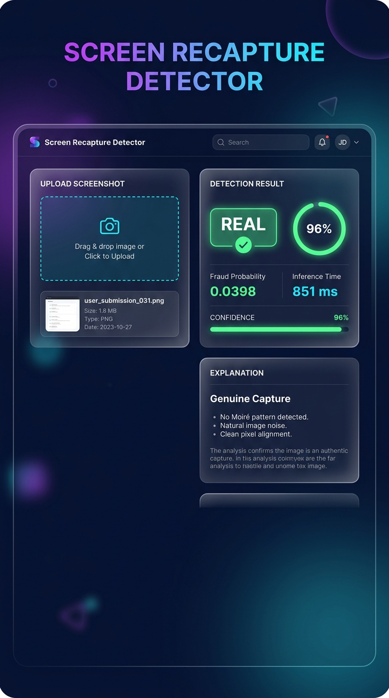

# Screen Recapture Detector (frauddetector)

https://huggingface.co/spaces/sthrrrr/frauddetector
[](https://python.org)
[](https://tensorflow.org)
[](https://flask.palletsprojects.com)

A lightweight hybrid computer vision pipeline for detecting whether an image is:

- **REAL** – a genuine photograph of a real-world object.
- **SCREEN** – a photograph of another screen (phone, laptop, monitor, tablet, etc.).

The solution was built for a take-home Computer Vision / Machine Learning assignment with an emphasis on accuracy, speed, and low inference cost.

---

## 🚀 Live Demo

**[→ Try the live demo]([https://frauddetector.onrender.com](https://huggingface.co/spaces/sthrrrr/frauddetector))**

Upload an image or use your camera to instantly detect whether it's a genuine photograph or a photo of a screen.

<p align="center">
  
</p>

### Features

- 📤 Drag & drop / file upload
- 📷 Camera capture (desktop + mobile)
- ⚡ Real-time inference with probability & confidence gauge
- 🌙 Dark mode glassmorphism UI
- 📱 Fully responsive (mobile-friendly)

---

## Approach

Instead of relying only on a deep neural network, this project combines learned visual features with handcrafted frequency-domain information.

The final model consists of:

- MobileNetV3Small (ImageNet pretrained)
- FFT-based moiré feature extraction
- Feature fusion
- Test-Time Augmentation (TTA)

The MobileNet branch learns subtle texture, lighting, glare and color characteristics, while the FFT branch captures periodic interference patterns (moiré) commonly produced when photographing electronic displays.

These complementary features are fused before the final classification layer.

---

## Repository Structure

```
.
├── app.py                    # Flask web application
├── predict.py                # Prediction pipeline
├── train_combined.py         # Model training
├── moire_feature.py          # FFT moiré feature extraction
├── evaluate.py               # Evaluation script
│
├── model/
│   ├── screen_detector_combined.keras
│   ├── moire_norm.npy
│   └── best_threshold.npy
│
├── templates/
│   └── index.html            # Web UI
│
├── static/
│   ├── style.css             # Dark glassmorphism theme
│   ├── app.js                # Frontend logic
│   └── favicon.svg           # App icon
│
├── dataset/
│   ├── real/
│   └── screen/
│
├── requirements.txt          # ML dependencies
├── demo_requirements.txt     # ML + web server dependencies
├── render.yaml               # Render deployment config
├── runtime.txt               # Python version
├── REPORT.md
└── README.md
```

---

## Installation

Create a virtual environment.

```bash
python3.11 -m venv venv
source venv/bin/activate
```

Install dependencies.

```bash
pip install -r requirements.txt
```

---

## Run the Web Demo Locally

Install the demo dependencies (includes Flask + Gunicorn).

```bash
pip install -r demo_requirements.txt
```

Start the Flask development server.

```bash
python app.py
```

Open [http://localhost:5000](http://localhost:5000) in your browser.

> **Note:** On macOS, port 5000 may be used by AirPlay Receiver. Use `PORT=5050 python app.py` as an alternative.

---


---

## Training

Train the hybrid model.

```bash
python train_combined.py
```

The script:

- computes FFT-based moiré scores,
- trains the MobileNetV3Small classifier,
- fine-tunes the backbone,
- searches for the best operating threshold,
- saves the trained model.

Saved files:

```
model/
    screen_detector_combined.keras
    moire_norm.npy
    best_threshold.npy
```

---

## Prediction

Predict a single image.

```bash
python predict.py path/to/image.jpg
```

Example output:

```
0.913728
```

Interpretation:

- **0.0** → likely REAL
- **1.0** → likely SCREEN

---

## Model Architecture

```
                 RGB Image
                     │
             MobileNetV3Small
                     │
        Global Average Pooling
                     │
                     ├────────────┐
                     │            │
                     │     FFT Moiré Score
                     │            │
                     └──────┬─────┘
                            │
                    Feature Concatenation
                            │
                     Fully Connected Layer
                            │
                       Sigmoid Output
```

---

## Features

- MobileNetV3Small (ImageNet pretrained)
- FFT-based frequency analysis
- Moiré detection
- Test-Time Augmentation
- Automatic threshold optimization
- CPU-friendly inference
- Lightweight deployment

---

## Future Improvements

- Larger and more diverse dataset
- Additional handcrafted frequency features
- TensorFlow Lite optimization
- Quantization for mobile devices
- Active learning from difficult production examples
- Cross-validation and probability calibration

---

## Author

Shourya Tuhar
